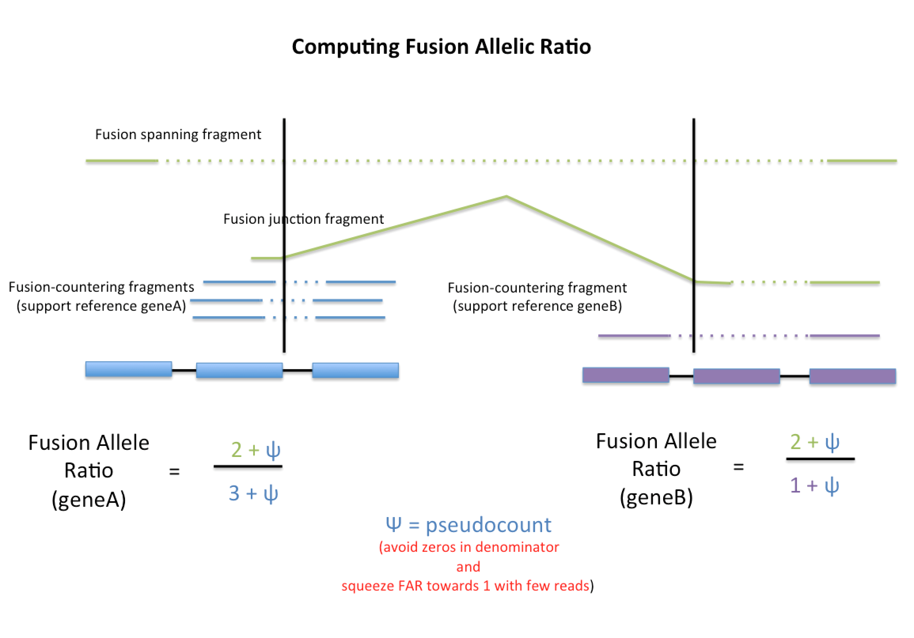

# FusionInspector: In silico Validation of Fusion Transcript Predictions


FusionInspector is a component of the [Trinity Cancer Transcriptome Analysis Toolkit (CTAT)](https://github.com/NCIP/Trinity_CTAT/wiki). FusionInspector assists in fusion transcript discovery by performing a supervised analysis of fusion predictions, attempting to recover and re-score evidence for such predictions. As of July, 2017, FusionInspector has been included as a component of the [STAR-Fusion](https://github.com/STAR-Fusion/STAR-Fusion/wiki)  suite.

Given a list of candidate fusion genes (as derived from running any fusion transcript prediction tool, such as [Prada](http://bioinformatics.mdanderson.org/main/PRADA:Overview), [FusionCatcher](http://biorxiv.org/content/early/2014/11/19/011650), [SoapFuse](http://soap.genomics.org.cn/soapfuse.html), [TophatFusion](http://ccb.jhu.edu/software/tophat/fusion_index.html), [DISCASM/GMAP-Fusion](https://github.com/DISCASM/DISCASM/wiki), [STAR-Fusion](https://github.com/STAR-Fusion/STAR-Fusion/wiki), or other), FusionInspector extracts the genomic regions for the fusion partners and constructs mini-fusion-contigs containing the pairs of genes in their proposed fused orientation.  The original reads are aligned to these candidate fusion contigs; fusion-supporting reads that would normally align as discordant pairs or split reads should align as concordant 'normal' reads in this fusion-gene context.  Those reads supporting each fusion (spanning fragments and fusion-breakpoint-containing reads) are identified, reported, and scored accordingly.

Optionally, Trinity de novo transcriptome assembly can be executed as part of the FusionInspector routine in order to de novo reconstruct fusion transcripts from the mapped reads.

Outputs generated by FusionInspector are easily viewed in a genome browser such as IGV so that the evidence for fusion transcripts can be manually assessed for read and alignment quality.

## Installation Requirements

### Software requirements:

FusionInspector requires the following companion software tools to be installed:

* [FusionInspector](https://github.com/FusionInspector/FusionInspector/releases) software itself, of course.

* [STAR](https://github.com/alexdobin/STAR) (obtain the very latest development version of STAR via 'git clone')

* [Trinity](https://github.com/trinityrnaseq/trinityrnaseq/wiki) (Even if you do not wish to de novo assemble fusion transcripts, components of the Trinity software are still required.)

* [samtools](https://sourceforge.net/projects/samtools/files/samtools/) (modern versions, 1.3+)

* [bgzip from the htslib package](https://github.com/samtools/htslib/releases/tag/1.3) 

* And the following non-standard Perl modules:

   * URI::Escape

   * Set::IntervalTree

   * DB_File

>The [cpanm](http://www.cpan.org/modules/INSTALL.html) tool is useful for local installations of these.

**Be sure STAR, samtools, and bgzip are available via your PATH env var setting, and create env var TRINITY_HOME set to the Trinity installation directory.**

### Data requirements

FusionInspector is a component of the [Trinity Cancer Transcriptome Analysis Toolkit](https://github.com/NCIP/Trinity_CTAT/wiki), and as with the other fusion-transcriptome components of CTAT, FusionInspector leverages the [FusionFilter](https://github.com/FusionFilter/FusionFilter/wiki) data resources.  Visit the [FusionFilter](https://github.com/FusionFilter/FusionFilter/wiki) website for links to existing data resources for human fusion transcript detection, or instructions on how to build your own data resources for use with CTAT.


## Running FusionInspector

FusionInspector requires one or more lists of fusion candidates, with each formatted like so, as geneA--geneB:

    B3GNT1--NPSR1
    ZNF709--DYRK1A
    ZNF844--NCBP2
    RBX1--HAPLN2
    FAM180B--TRIM60
    CASP9--ADCYAP1
    HS3ST3A1--C1QTNF2
    OPTC--AP000347.4
    GRIA2--ZW10


We'll call the file containing this list 'fusions.listA.txt'.  Let's assume we have another such list from another source, and we'll call it 'fusions.listB.txt'.

>It's ok to have a tab-delimited file containing other attributes (such as the raw output from some fusion-prediction tool) as long as the first column fits the above format.

Given this list of fusions, we'll run FusionInspector like so:

    FusionInspector --fusions fusions.listA.txt,fusions.listB.txt \
                    --genome_lib /path/to/CTAT_genome_lib \
                    --left_fq rnaseq_1.fq --right_fq rnaseq_2.fq \
                    --out_dir my_FusionInspector_outdir \
                    --out_prefix finspector \
                    --prep_for_IGV

## Output of FusionInspector

The final output of FusionInspector is a file called 'finspector.fusion_predictions.final.abridged.FFPM', which you'll find in the --out_dir specified.  The format of this file is tab-delimited and contains the following fields and formatting:

>Scroll the window below to the right to see all the fields.

```
#FusionName            JunctionReadCount  SpanningFragCount  LeftGene                         LeftLocalBreakpoint  LeftBreakpoint     RightGene                        RightLocalBreakpoint  RightBreakpoint    SpliceType                    LargeAnchorSupport  NumCounterFusionLeft  NumCounterFusionRight  FAR_left  FAR_right  LeftBreakDinuc  LeftBreakEntropy  RightBreakDinuc  RightBreakEntropy  FFPM
THRA--AC090627.1       88                 97                 THRA^ENSG00000126351.8           11793                chr17:38243106:+   AC090627.1^ENSG00000235300.3     21568                 chr17:46371709:+   ONLY_REF_SPLICE               YES                 24                    0                      7.44      186.00     GT              1.8892            AG               1.9656             8.6326
ACACA--STAC2           62                 45                 ACACA^ENSG00000132142.15         66695                chr17:35479453:-   STAC2^ENSG00000141750.6          81161                 chr17:37374426:-   ONLY_REF_SPLICE               YES                 233                   1                      0.46      54.00      GT              1.9656            AG               1.9656             4.9929
RPS6KB1--SNF8          37                 46                 RPS6KB1^ENSG00000108443.9        1240                 chr17:57970686:+   SNF8^ENSG00000159210.5           26089                 chr17:47021337:-   ONLY_REF_SPLICE               YES                 93                    486                    0.89      0.17       GT              1.3753            AG               1.8323             3.873
TOB1--SYNRG            22                 35                 TOB1^ENSG00000141232.4           2782                 chr17:48943419:-   SYNRG^ENSG00000006114.11         37847                 chr17:35880751:-   ONLY_REF_SPLICE               YES                 104                   49                     0.55      1.16       GT              1.4566            AG               1.8892             2.6598
VAPB--IKZF3            20                 38                 VAPB^ENSG00000124164.11          1396                 chr20:56964573:+   IKZF3^ENSG00000161405.12         28254                 chr17:37934020:-   ONLY_REF_SPLICE               YES                 393                   7                      0.15      7.38       GT              1.9656            AG               1.7819             2.7064
THRA--AC090627.1       15                 24                 THRA^ENSG00000126351.8           11793                chr17:38243106:+   AC090627.1^ENSG00000235300.3     23800                 chr17:46384693:+   ONLY_REF_SPLICE               YES                 24                    153                    1.60      0.26       GT              1.8892            AG               1.4295             1.8198
ZMYND8--CEP250         9                  42                 ZMYND8^ENSG00000101040.15        29057                chr20:45852970:-   CEP250^ENSG00000126001.11        56963                 chr20:34078463:+   ONLY_REF_SPLICE               YES                 64                    6                      0.80      7.43       GT              1.8295            AG               1.8062             2.3798
STX16--RAE1            9                  29                 STX16^ENSG00000124222.17         1816                 chr20:57227143:+   RAE1^ENSG00000101146.8           18335                 chr20:55929088:+   ONLY_REF_SPLICE               YES                 209                   517                    0.19      0.08       GT              1.9899            AG               1.9656             1.7732
MED1--STXBP4           12                 14                 MED1^ENSG00000125686.7           1249                 chr17:37607291:-   STXBP4^ENSG00000166263.9         44835                 chr17:53218671:+   ONLY_REF_SPLICE               YES                 252                   9                      0.11      2.70       GT              1.3996            AG               1.7968             1.2132
AHCTF1--NAAA           7                  28                 AHCTF1^ENSG00000153207.10        1401                 chr1:247094880:-   NAAA^ENSG00000138744.10          50972                 chr4:76846964:-    ONLY_REF_SPLICE               YES                 24                    52                     1.44      0.68       GT              1.7232            AG               1.8062             1.6331
VAPB--IKZF3            3                  44                 VAPB^ENSG00000124164.11          1396                 chr20:56964573:+   IKZF3^ENSG00000161405.12         26679                 chr17:37944627:-   ONLY_REF_SPLICE               YES                 393                   0                      0.12      48.00      GT              1.9656            AG               1.8892             2.1931
RAB22A--MYO9B          11                 10                 RAB22A^ENSG00000124209.3         2397                 chr20:56886178:+   MYO9B^ENSG00000099331.9          23218                 chr19:17256207:+   ONLY_REF_SPLICE               YES                 124                   20                     0.18      1.05       GT              1.6895            AG               1.9656             0.9799
MED1--ACSF2            11                 9                  MED1^ENSG00000125686.7           6915                 chr17:37595418:-   ACSF2^ENSG00000167107.8          36449                 chr17:48548389:+   ONLY_REF_SPLICE               YES                 262                   227                    0.08      0.09       GT              1.9656            AG               1.9656             0.9333
RPS6KB1--SNF8          1                  46                 RPS6KB1^ENSG00000108443.9        1839                 chr17:57971285:+   SNF8^ENSG00000159210.5           26089                 chr17:47021337:-   ONLY_REF_SPLICE               NO                  95                    486                    0.50      0.10       GT              1.9086            AG               1.8323             2.1932
STX16--RAE1            3                  33                 STX16^ENSG00000124222.17         3048                 chr20:57234690:+   RAE1^ENSG00000101146.8           18335                 chr20:55929088:+   ONLY_REF_SPLICE               NO                  195                   517                    0.19      0.07       GT              1.7465            AG               1.9656             1.6799
TIMM23--PARGP1         10                 4                  TIMM23^ENSG00000138297.9         6952                 chr10:51606988:-   PARGP1^ENSG00000214982.6         27883                 chr10:51732772:+   ONLY_REF_SPLICE               YES                 131                   0                      0.11      15.00      GT              1.7819            AG               1.9086             0.6532
STX16--RAE1            2                  33                 STX16^ENSG00000124222.17         1867                 chr20:57227194:+   RAE1^ENSG00000101146.8           18335                 chr20:55929088:+   ONLY_REF_SPLICE               YES                 201                   517                    0.18      0.07       GT              1.9329            AG               1.9656             1.6332
SKA2--MYO19            7                  8                  SKA2^ENSG00000182628.8           1139                 chr17:57232492:-   MYO19^ENSG00000141140.12         29259                 chr17:34863763:-   ONLY_REF_SPLICE               YES                 170                   68                     0.09      0.23       GT              1.9086            AG               1.7819             0.6999
AHCTF1--NAAA           1                  29                 AHCTF1^ENSG00000153207.10        1850                 chr1:247094431:-   NAAA^ENSG00000138744.10          50972                 chr4:76846964:-    ONLY_REF_SPLICE               NO                  24                    52                     1.24      0.58       GT              1.9086            AG               1.8062             1.3999
SKA2--MYO19            6                  6                  SKA2^ENSG00000182628.8           1139                 chr17:57232492:-   MYO19^ENSG00000141140.12         29671                 chr17:34863351:-   ONLY_REF_SPLICE               YES                 170                   98                     0.08      0.13       GT              1.9086            AG               1.9086             0.56
STARD3--DOK5           6                  6                  STARD3^ENSG00000131748.11        1167                 chr17:37793484:+   DOK5^ENSG00000101134.7           23084                 chr20:53259997:+   ONLY_REF_SPLICE               YES                 511                   0                      0.03      13.00      GT              1.8892            AG               1.9656             0.56
VAPB--IKZF3            4                  9                  VAPB^ENSG00000124164.11          1396                 chr20:56964573:+   IKZF3^ENSG00000161405.12         29371                 chr17:37922746:-   ONLY_REF_SPLICE               YES                 393                   29                     0.04      0.47       GT              1.9656            AG               1.9329             0.6066
DIDO1--TTI1            1                  10                 DIDO1^ENSG00000101191.12         1157                 chr20:61569148:-   TTI1^ENSG00000101407.8           31303                 chr20:36642259:-   ONLY_REF_SPLICE               NO                  17                    24                     0.67      0.48       GT              1.6402            AG               1.9329             0.5133
GLB1--CMTM7            2                  6                  GLB1^ENSG00000170266.11          23601                chr3:33055548:-    CMTM7^ENSG00000153551.9          29734                 chr3:32483332:+    ONLY_REF_SPLICE               NO                  15                    0                      0.56      9.00       GT              1.9329            AG               1.9086             0.3733
TRPC4AP--MRPL45        2                  6                  TRPC4AP^ENSG00000100991.7        2387                 chr20:33665849:-   MRPL45^ENSG00000174100.5         30682                 chr17:36476502:+   ONLY_REF_SPLICE               NO                  362                   553                    0.02      0.02       GT              1.6895            AG               1.9656             0.3733
LAMP1--MCF2L           2                  5                  LAMP1^ENSG00000185896.9          1255                 chr13:113951810:+  MCF2L^ENSG00000126217.16         46545                 chr13:113718618:+  ONLY_REF_SPLICE               YES                 82                    44                     0.10      0.18       GT              1.5656            AG               1.9899             0.3266
CPNE1--PI3             2                  4                  CPNE1^ENSG00000214078.7          3826                 chr20:34243124:-   PI3^ENSG00000124102.4            14948                 chr20:43804502:+   ONLY_REF_SPLICE               NO                  111                   0                      0.06      7.00       GT              1.6729            AG               1.9219             0.2799
ZMYND8--CEP250         2                  4                  ZMYND8^ENSG00000101040.15        29057                chr20:45852970:-   CEP250^ENSG00000126001.11        57538                 chr20:34079038:+   ONLY_REF_SPLICE               NO                  64                    100                    0.11      0.07       GT              1.8295            AG               1.8892             0.2799
DIDO1--TTI1            1                  7                  DIDO1^ENSG00000101191.12         1157                 chr20:61569148:-   TTI1^ENSG00000101407.8           34646                 chr20:36634799:-   ONLY_REF_SPLICE               NO                  17                    25                     0.50      0.35       GT              1.6402            AG               1.8892             0.3733
FITM2--UQCC1           2                  3                  FITM2^ENSG00000197296.5          1194                 chr20:42939616:-   UQCC1^ENSG00000101019.17         25551                 chr20:33902568:-   ONLY_REF_SPLICE               YES                 65                    164                    0.09      0.04       GT              1.8892            AG               1.8062             0.2333
ASTN2--RP11-281A20.1   2                  2                  ASTN2^ENSG00000148219.12         2762                 chr9:120053605:-   RP11-281A20.1^ENSG00000231901.1  38824                 chr9:120632505:-   ONLY_REF_SPLICE               YES                 2                     0                      1.67      5.00       GT              1.9219            AG               1.8892             0.1866
BRD4--RFX1             2                  2                  BRD4^ENSG00000141867.13          1256                 chr19:15443101:-   RFX1^ENSG00000132005.4           33748                 chr19:14104707:-   ONLY_REF_SPLICE               NO                  30                    12                     0.16      0.38       GT              1.9086            AG               0.9056             0.1866
TRPC4AP--MRPL45        2                  2                  TRPC4AP^ENSG00000100991.7        2387                 chr20:33665849:-   MRPL45^ENSG00000174100.5         31832                 chr17:36478009:+   ONLY_REF_SPLICE               YES                 362                   696                    0.01      0.01       GT              1.6895            AG               1.9086             0.1866
BRD4--RFX1             2                  1                  BRD4^ENSG00000141867.13          1256                 chr19:15443101:-   RFX1^ENSG00000132005.4           35119                 chr19:14094407:-   ONLY_REF_SPLICE               NO                  30                    34                     0.13      0.11       GT              1.9086            AG               1.8295             0.14
CTD-2319I12.2--HEATR6  2                  1                  CTD-2319I12.2^ENSG00000267416.1  1164                 chr17:58156833:+   HEATR6^ENSG00000068097.10        17130                 chr17:58136882:-   ONLY_REF_SPLICE               NO                  1                     48                     2.00      0.08       GT              1.8892            AG               1.8892             0.14
TRIM37--MYO19          2                  1                  TRIM37^ENSG00000108395.9         7217                 chr17:57161363:-   MYO19^ENSG00000141140.12         53005                 chr17:34863351:-   ONLY_REF_SPLICE               NO                  106                   99                     0.04      0.04       GT              1.7465            AG               1.9086             0.14
MED13--BCAS3           0                  8                  MED13^ENSG00000108510.5          37194                chr17:60023961:-   BCAS3^ENSG00000141376.16         40195                 chr17:58754814:+   NO_JUNCTION_READS_IDENTIFIED  NO                  0                     0                      9.00      9.00       TT              1.9329            GC               1.8062             0.3733
MED13--BCAS3           1                  3                  MED13^ENSG00000108510.5          3547                 chr17:60129898:-   BCAS3^ENSG00000141376.16         94861                 chr17:59469338:+   ONLY_REF_SPLICE               NO                  16                    54                     0.29      0.09       GT              1.5546            AG               1.9086             0.1867
PIP4K2B--RAD51C        1                  3                  PIP4K2B^ENSG00000141720.7        9121                 chr17:36933940:-   RAD51C^ENSG00000108384.10        29822                 chr17:56801401:+   ONLY_REF_SPLICE               NO                  441                   69                     0.01      0.07       GT              1.7968            AG               1.6402             0.1867
TRIM37--MYO19          1                  3                  TRIM37^ENSG00000108395.9         7217                 chr17:57161363:-   MYO19^ENSG00000141140.12         52593                 chr17:34863763:-   ONLY_REF_SPLICE               NO                  106                   68                     0.05      0.07       GT              1.7465            AG               1.7819             0.1867
BRD4--RFX1             1                  2                  BRD4^ENSG00000141867.13          1256                 chr19:15443101:-   RFX1^ENSG00000132005.4           32548                 chr19:14109129:-   ONLY_REF_SPLICE               NO                  30                    2                      0.13      1.33       GT              1.9086            AG               1.8892             0.14
PIP4K2B--RAD51C        1                  1                  PIP4K2B^ENSG00000141720.7        9121                 chr17:36933940:-   RAD51C^ENSG00000108384.10        31035                 chr17:56809845:+   ONLY_REF_SPLICE               NO                  441                   95                     0.01      0.03       GT              1.7968            AG               1.9329             0.0934
PIP4K2B--RAD51C        1                  1                  PIP4K2B^ENSG00000141720.7        9121                 chr17:36933940:-   RAD51C^ENSG00000108384.10        31032                 chr17:56809842:+   ONLY_REF_SPLICE               NO                  441                   94                     0.01      0.03       GT              1.7968            AG               1.9899             0.0934
PIP4K2B--RAD51C        1                  1                  PIP4K2B^ENSG00000141720.7        9121                 chr17:36933940:-   RAD51C^ENSG00000108384.10        32318                 chr17:56811479:+   ONLY_REF_SPLICE               NO                  441                   90                     0.01      0.03       GT              1.7968            AG               1.9899             0.0934
```

>The above results correspond to fusions in a breast cancer cell line BT474, first predicted by STAR-Fusion, and then further 'insilico validated' using FusionInspector.

There is also a .final file which contains most of the above fields along with the identity of the reads corresponding to fusion-supporting fragments. This file can be very large, and so the abridged version easier to navigate.

The columns of the output are described below:

```
#FusionName: name of the fusion as geneA--geneB
JunctionReadCount: number of split RNA-Seq reads that map and define the fusion breakpoint.
SpanningFragCount: number of paired-end reads that span the fusion breakpoint but the reads do not directly overlap the breakpoint.
LeftGene: identifier of the gene represented by the left section of the fusion transcript.
LeftLocalBreakpoint: position of the left fusion breakpoint in the context of the FusionInspector mini-fusion-gene contig.
LeftBreakpoint: position of the left fusion breakpoint in the context of the genome.
RightGene:  identifier of the gene represented by the right section of the fusion transcript.
RightLocalBreakpoint: position of the right fusion breakpoint in the context of the FusionInspector min-fusion-gene contig.
RightBreakpoint: position of the right fusion breakpoint in the context of the genome.
SpliceType: category of support at the fusion breakpoint: {
                ONLY_REF_SPLICE: fusion breakpoint occurs at reference (known) splice junctions.
                INCL_NON_REF_SPLICE: fusion breakpoint occurs at a breakpoint that does not involve all reference (known) exon junctions.
                NO_JUNCTION_READS_IDENTIFIED: only spanning fragments support the fusion. (can only happen if --min_junction_reads is set to zero).
           }
LargeAnchorSupport:  YES|NO, indicates whether there are at least 25 aligned bases on each side of the fusion breakpoint.
NumCounterFusionLeft:  Number of RNA-Seq fragments supporting the alternative non-fused allele at the left junction breakpoint. 
NumCounterFusionRight:  Number of RNA-Seq fragments supporting the alternative non-fused allele at the right junction breakpoint.
FAR_left:  Left fusion allelic ratio (see figure below)
FAR_right:  Right fusion allelic ratio  (see figure below)
LeftBreakDinuc: the genomic dinucleotides found at the left breakpoint (putative splice site if splicing is involved).
LeftBreakEntropy: entropy calculation for the 15 bases immediately upstream from the fusion junction.
RightBreakDinuc:  the genomic dinucleotides found at the right breakpoint (putative splice site if splicing is involved).
RightBreakEntropy: entropy calculation for the 15 bases immediately downstream from the fusion junction.
FFPM: normalized measure of the quantity of RNA-Seq fragments supporting the fusion event as:  fusion fragments per total million RNA-Seq fragments.
```

### Fusion Allelic Ratio

The fusion allelic ratio (FAR) is computed as a pragmatic way of estimating the relative expression of the fusion transcript as compared to the alternative non-fused allele of the gene.  The method underlying the calculation is illustrated below:



In the above image, there are 2 fusion-supporting fragments (green), there are 3 fragments (blue) that correspond to the non-fused geneA allele, and there is 1 fragment (purple) supporting the non-fused geneB allele.  The fusion allele ratio (FAR) is computed separately for each of the fused genes and reflects the proportion of evidence supporting the fused-allele as compared to the number of reads supporting the non-fused allele and overlapping the fusion transcript breakpoint.  While this is not a highly accurate measurement of the ratio of fused vs. non-fused transcripts, it's a useful metric to serve as a proxy for this information.  Accurate measurements would require performing abundance estimation based on knowing the exact structures and lengths of the full-length fused and non-fused isoforms being expressed.  This additional functionality is still pending but will be addressed in a future software release.  

>For now, we use FFPM as our proxy for fusion transcript expression, and FAR as a proxy for relative expression of the fusion transcript to non-fused alleles.

## Visualizing the Fusion Evidence

When the '--prep\_for_IGV' parameter is specified, a number of files as shown below are generated for viewing in the IGV (or other) genome browser:


    finspector.fa : the candidate fusion-gene contigs (if you copy things elsewhere, make sure to als copy the index file finspector.fa.fai)
    finspector.bed : the reference gene structure annotations for fusion partners
    finspector.junction_reads.bam : alignments of the breakpoint-junction supporting reads.
    finspector.spanning_reads.bam : alignments of the breakpoint-spanning paired-end reads.

An example of viewing a fusion candidate with recovered read evidence using IGV is shown below. 

You can load the 'finspector.fa' as a 'new genome' and then load up the various gtf and bam files for viewing, or simply run a command like so (assuming you have IGV installed and the 'igv.sh' script in your PATH setting):

    %  igv.sh -g `pwd`/finspector.fa \
    `pwd`/finspector.gtf,`pwd`/finspector.spanning_reads.bam,`pwd`/finspector.junction_reads.bam

Or, if you want to load in via the graphical menu options, simply do the following:

```
Menu->Genomes->Create .genome File using IGV and use the following files which are in FusionInspector-inspect folder :

finspector.fa # note: if you copy things: the index file finspector.fa.fai should be in the same folder
finspector.gtf
cytoBand.txt
```
After this, load the genome and File -> Add ...

```
finspector.junction_reads.bam  # if you copy things: the  *.bam.bai index files should be in the same folder
finspector.spanning_reads.bam
```

and the view would look similar to this:


where you can readily examine the paired-end and split-read evidence for any of the supported fusions. 


## Example data and execution

See the 'test/' subdirectory and examine the README.txt file included.  Example data and command execution info are provided.


## User support

Contact us on our google group <https://groups.google.com/forum/#!forum/trinity_ctat_users>

## Acknowledgements

FusionInspector is primarily a collaboration between [Brian Haas (Broad Institute)](https://personal.broadinstitute.org/bhaas/) and [Alex Dobin (Cold Spring Harbor Laboratory)](https://scholar.google.com/citations?user=2LAxpBsAAAAJ&hl=en), and developed as part of the [Trinity Cancer Transcriptome Analysis Toolkit](https://github.com/NCIP/Trinity_CTAT/wiki).
