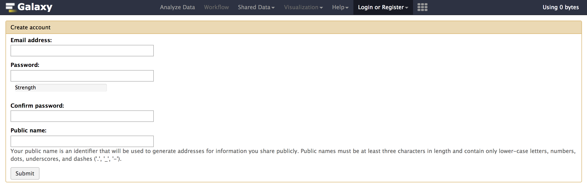
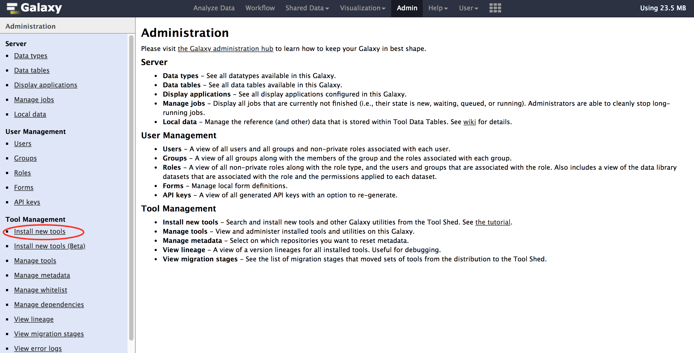
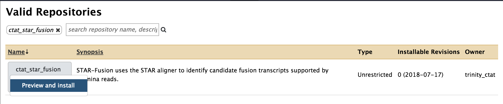
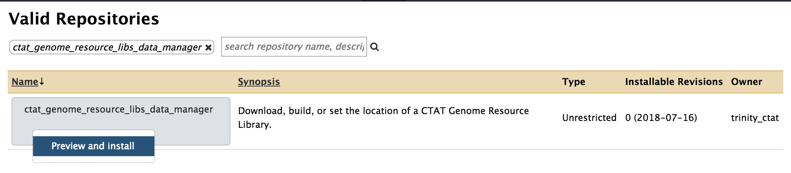
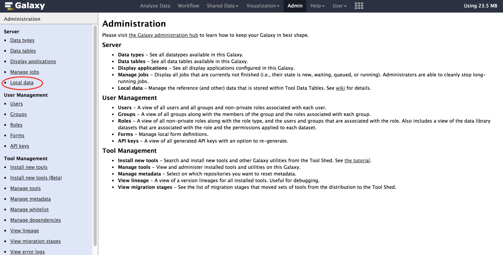
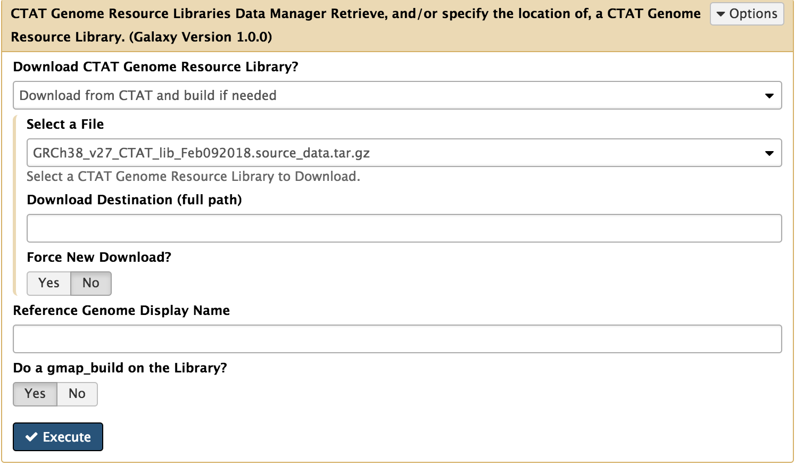
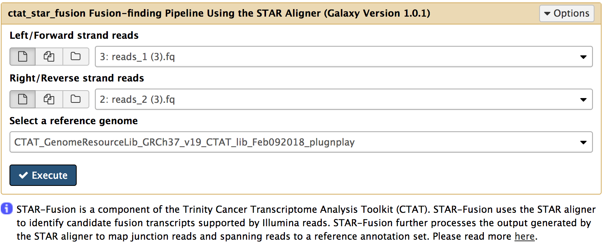

1. Git clone Galaxy by following instructions [here](https://galaxyproject.org/admin/get-galaxy/).
2. cd </path/to/galaxy>
3. Configure Galaxy (config/galaxy.yml) with settings below:
   1. admin_users: <your_email_id>
   2. conda_prefix: </valid/path/>
   3. conda_auto_install: true
   4. conda_auto_init: true
4. Run Galaxy:
    `sh run.sh`
5. Register and login with your admin email id used in config/galaxy.yml as below:

6. Go to the Admin tab on the top panel
7. Select Install new tools and select Galaxy Tool Shed

8. Search for star-fusion and install it

9. Similarly install ctat_genome_resource_libs_data_manager

10. Next download to ctat_genome_resource_libs_data_manager on your server/machine, click on Local Data (under Admin Tab). Under Data Manager Tools select ctat_genome_resource_libs_data_manager and fill the form as below (this may take a while):

11. If install and download was a success then upload a right and left fastq files using the Get Data tool. Some test data is available [here](https://github.com/STAR-Fusion/STAR-Fusion/tree/master/testing).
12. Run the STAR-Fusion tool, leave all settings to default and select required genome. 

13. In the right side history panel you will notice among other outputs, a web report. Click on eye button to view the report. 